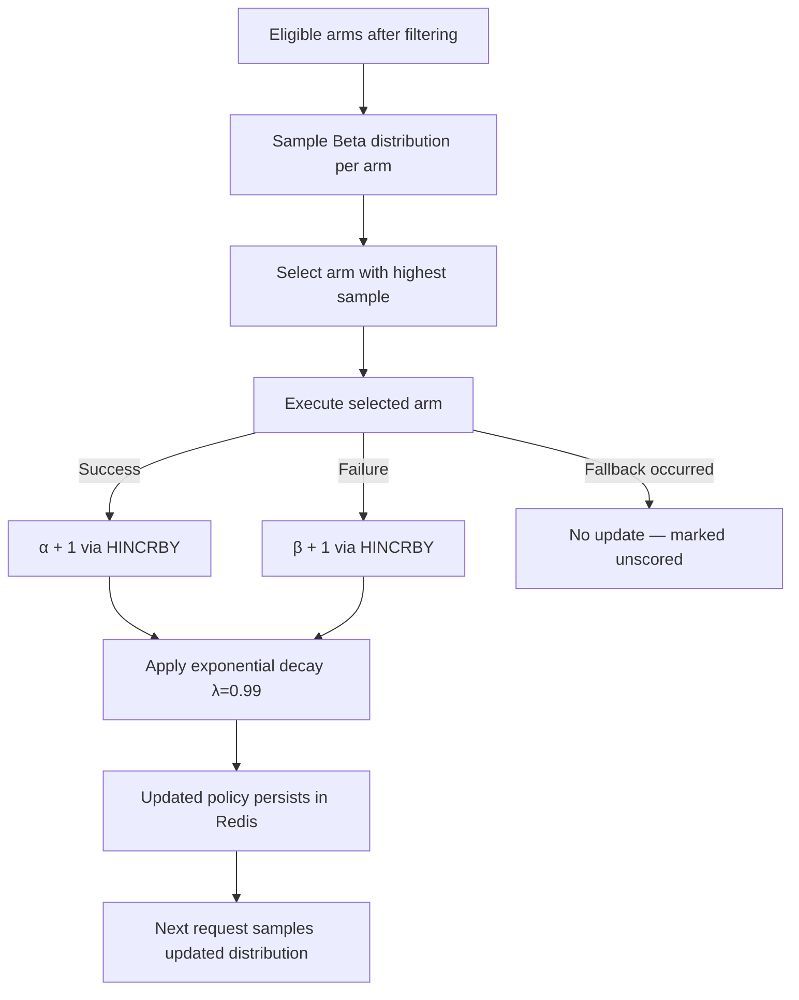

# Bandit policy

```mermaid
flowchart TD
    A[Eligible arms after filtering] --> B[Sample Beta distribution per arm]
    B --> C[Select arm with highest sample]
    C --> D[Execute selected arm]
    D -->|Success| E[α + 1 via HINCRBY]
    D -->|Failure| F[β + 1 via HINCRBY]
    D -->|Fallback occurred| G[No update — marked unscored]
    E --> H[Apply exponential decay λ=0.99]
    F --> H
    H --> I[Updated policy persists in Redis]
    I --> J[Next request samples updated distribution]
```
