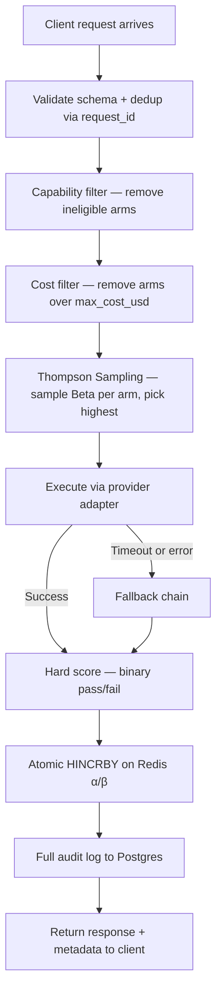

# Core request loop

```mermaid
flowchart TD
    A[Client request arrives] --> B[Validate schema + dedup via request_id]
    B --> C[Capability filter — remove ineligible arms]
    C --> D[Cost filter — remove arms over max_cost_usd]
    D --> E[Thompson Sampling — sample Beta per arm, pick highest]
    E --> F[Execute via provider adapter]
    F -->|Success| G[Hard score — binary pass/fail]
    F -->|Timeout or error| H[Fallback chain]
    H --> G
    G --> I[Atomic HINCRBY on Redis α/β]
    I --> J[Full audit log to Postgres]
    J --> K[Return response + metadata to client]
```
