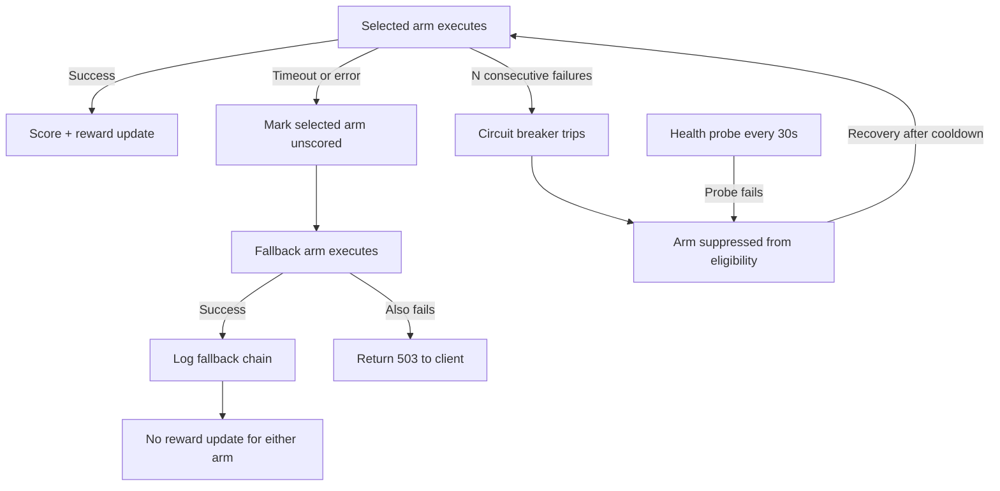

# Fallback and circuit breaker

```mermaid
flowchart TD
    A[Selected arm executes] -->|Success| B[Score + reward update]
    A -->|Timeout or error| C[Mark selected arm unscored]
    C --> D[Fallback arm executes]
    D -->|Success| E[Log fallback chain]
    D -->|Also fails| F[Return 503 to client]
    E --> G[No reward update for either arm]
    A -->|N consecutive failures| H[Circuit breaker trips]
    H --> I[Arm suppressed from eligibility]
    J[Health probe every 30s] -->|Probe fails| I
    I -->|Recovery after cooldown| A
```
