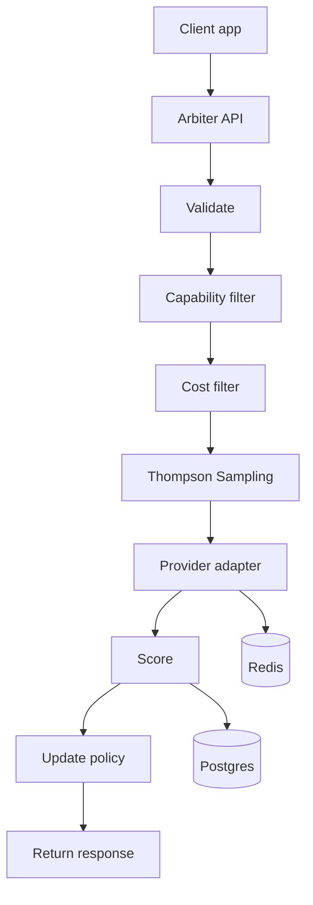

# System overview

```mermaid
flowchart TD
    A[Client app] --> B[Arbiter API]
    B --> C[Validate]
    C --> D[Capability filter]
    D --> E[Cost filter]
    E --> F[Thompson Sampling]
    F --> G[Provider adapter]
    G --> H[Score]
    H --> I[Update policy]
    I --> J[Return response]
    G --> K[(Redis)]
    H --> L[(Postgres)]
```
