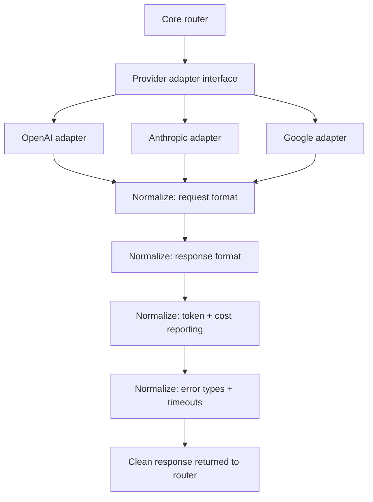

# Provider abstraction

```mermaid
flowchart TD
    A[Core router] --> B[Provider adapter interface]
    B --> C[OpenAI adapter]
    B --> D[Anthropic adapter]
    B --> E[Google adapter]
    C --> F[Normalize: request format]
    D --> F
    E --> F
    F --> G[Normalize: response format]
    G --> H[Normalize: token + cost reporting]
    H --> I[Normalize: error types + timeouts]
    I --> J[Clean response returned to router]
```
