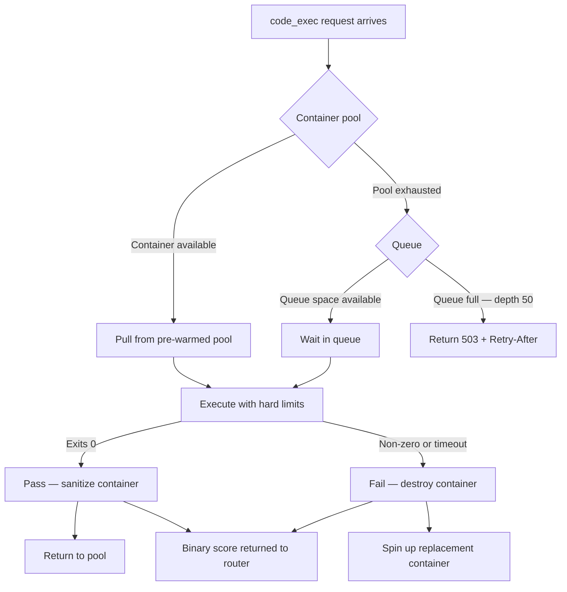

# Code execution sandbox

```mermaid
flowchart TD
    A[code_exec request arrives] --> B{Container pool}
    B -->|Container available| C[Pull from pre-warmed pool]
    B -->|Pool exhausted| D{Queue}
    D -->|Queue space available| E[Wait in queue]
    D -->|Queue full — depth 50| F[Return 503 + Retry-After]
    C --> G[Execute with hard limits]
    E --> G
    G -->|Exits 0| H[Pass — sanitize container]
    G -->|Non-zero or timeout| I[Fail — destroy container]
    H --> J[Return to pool]
    I --> K[Spin up replacement container]
    H --> L[Binary score returned to router]
    I --> L
```
