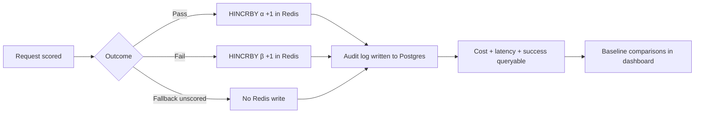

# State management

```mermaid
flowchart LR
    A[Request scored] --> B{Outcome}
    B -->|Pass| C[HINCRBY α +1 in Redis]
    B -->|Fail| D[HINCRBY β +1 in Redis]
    B -->|Fallback unscored| E[No Redis write]
    C --> F[Audit log written to Postgres]
    D --> F
    E --> F
    F --> G[Cost + latency + success queryable]
    G --> H[Baseline comparisons in dashboard]
```
